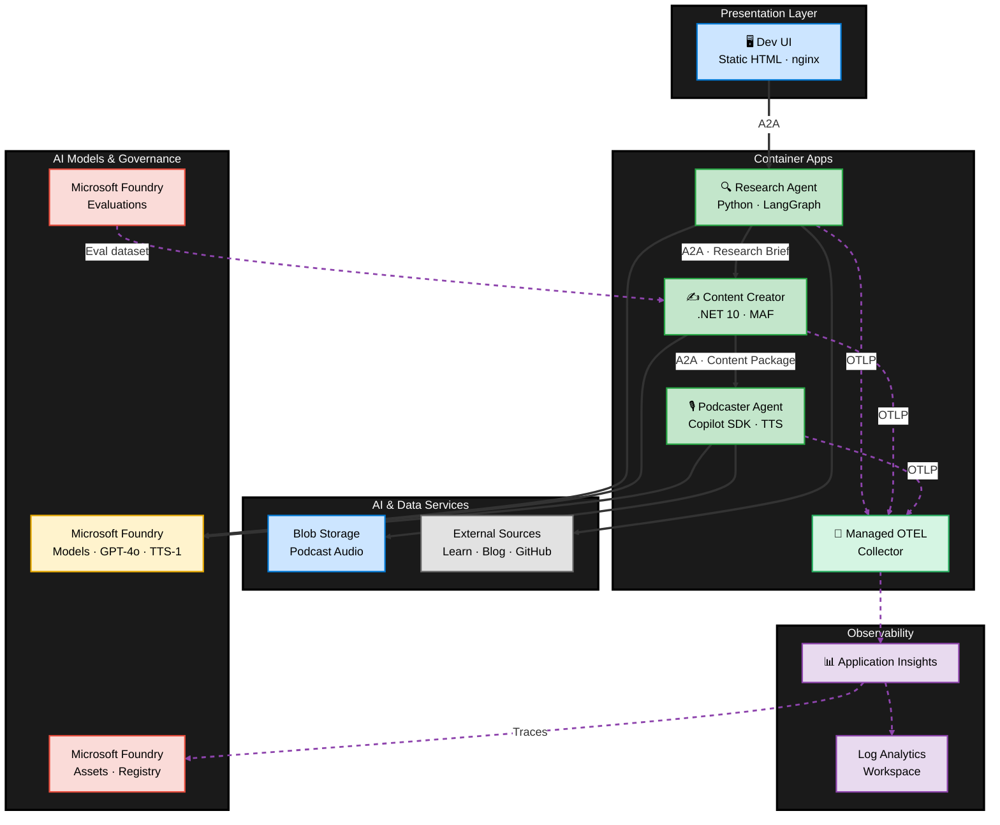

## Architecture (Top-Down)

Emphasizes the platform layers: presentation → agent pipeline → AI services → observability & governance. Good for explaining the stack to architects.

```mermaid
---
config:
  theme: base
  themeVariables:
    lineColor: "#333"
    primaryColor: "#fff"
  flowchart:
    curve: basis
---
graph TB
    subgraph Presentation["Presentation Layer"]
        DevUI["🖥️ Dev UI<br/>Static HTML · nginx"]
    end

    subgraph Pipeline["Container Apps"]
        direction LR
        A1["🔍 Research Agent<br/>Python · LangGraph"]
        A2["✍️ Content Creator<br/>.NET 10 · MAF"]
        A3["🎙️ Podcaster Agent<br/>Copilot SDK · TTS"]
        OTEL["📡 Managed OTEL<br/>Collector"]
    end

     subgraph AI["AI & Data Services"]
        direction LR
        Blob["Blob Storage<br/>Podcast Audio"]
        Sources["External Sources<br/>Learn · Blog · GitHub"]
    end

    subgraph LL["AI Models & Governance"]
        direction LR
        AOAI["Microsoft Foundry<br/>Models · GPT-4o · TTS-1"]
        FoundryAssets["Microsoft Foundry<br/>Assets · Registry"]
        FoundryEvals["Microsoft Foundry<br/>Evaluations"]
    end

   
    
    subgraph Observe["Observability"]
        direction LR
        AppIns["📊 Application Insights"]
        Logs["Log Analytics<br/>Workspace"]
    end


    DevUI == "A2A" ==> A1
    A1 == "A2A · Research Brief" ==> A2
    A2 == "A2A · Content Package" ==> A3
    A1 ==> Sources
    A1 ==> AOAI
    A2 ==> AOAI
    A3 ==> AOAI
    A3 ==> Blob

    A1 -. "OTLP" .-> OTEL
    A2 -. "OTLP" .-> OTEL
    A3 -. "OTLP" .-> OTEL
    OTEL ==> AppIns
    AppIns ==> Logs
    AppIns -. "Traces" .-> FoundryAssets
    FoundryEvals -. "Eval dataset" .-> A2

    %% Subgraph frames: black fill, white text
    style Presentation fill:#1a1a1a,stroke:#000,stroke-width:3px,color:#fff
    style Pipeline fill:#1a1a1a,stroke:#000,stroke-width:3px,color:#fff
    style AI fill:#1a1a1a,stroke:#000,stroke-width:3px,color:#fff
    style LL fill:#1a1a1a,stroke:#000,stroke-width:3px,color:#fff
    style Observe fill:#1a1a1a,stroke:#000,stroke-width:3px,color:#fff

    %% Inner boxes: colored fills with dark text
    style DevUI fill:#cce5ff,stroke:#0078d4,stroke-width:2px,color:#000
    style A1 fill:#c3e6cb,stroke:#28a745,stroke-width:2px,color:#000
    style A2 fill:#c3e6cb,stroke:#28a745,stroke-width:2px,color:#000
    style A3 fill:#c3e6cb,stroke:#28a745,stroke-width:2px,color:#000
    style AOAI fill:#fff3cd,stroke:#e6a800,stroke-width:2px,color:#000
    style FoundryAssets fill:#fadbd8,stroke:#e74c3c,stroke-width:2px,color:#000
    style FoundryEvals fill:#fadbd8,stroke:#e74c3c,stroke-width:2px,color:#000
    style Blob fill:#cce5ff,stroke:#0078d4,stroke-width:2px,color:#000
    style Sources fill:#e2e2e2,stroke:#666,stroke-width:2px,color:#000
    style OTEL fill:#d5f5e3,stroke:#27ae60,stroke-width:2px,color:#000
    style AppIns fill:#e8daef,stroke:#8e44ad,stroke-width:2px,color:#000
    style Logs fill:#e8daef,stroke:#8e44ad,stroke-width:2px,color:#000

    linkStyle 0,1,2,3,4,5,6,7 stroke:#333,stroke-width:3px
    linkStyle 8,9,10,11,12,13,14 stroke:#8e44ad,stroke-width:2.5px,stroke-dasharray:6
```