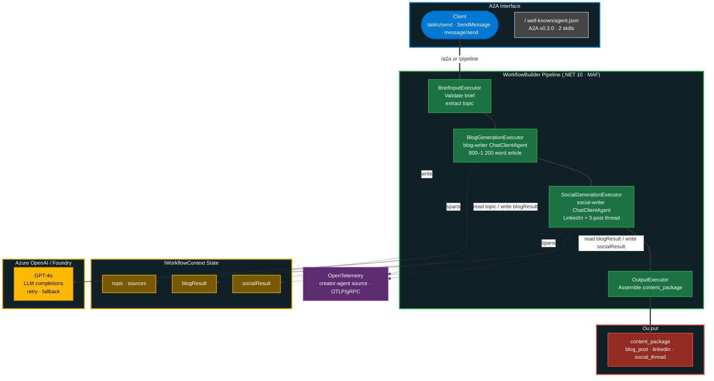

# Content Creator Agent Architecture

.NET agent on [Microsoft Agent Framework](https://github.com/microsoft/agent-framework) that transforms a research brief into a content package (blog + LinkedIn + Social thread). Follows the [CustomAgentExecutors](https://github.com/microsoft/agent-framework/tree/main/dotnet/samples/03-workflows/Agents/CustomAgentExecutors) pattern: each executor owns its own `ChatClientAgent` + `AgentSession` and calls `RunAsync(prompt, session)` directly.

**Stack:** C# / .NET 10 / ASP.NET Minimal API / `Microsoft.Agents.AI` + `Microsoft.Agents.AI.Workflows` / Azure OpenAI / OpenTelemetry

## Architecture Diagram



## Executor-Owned Agents (CustomAgentExecutors Pattern)

Each workflow executor constructs its own `ChatClientAgent` with role-specific `instructions` and manages its own `AgentSession` — following the MAF best practice where executors own the agent lifecycle:

```csharp
// Inside BlogGenerationExecutor constructor
_agent = new ChatClientAgent(chatClient,
        name: "blog-writer",
        instructions: "You are an expert technical writer creating original content...")
    .AsBuilder()
    .UseOpenTelemetry(sourceName: "creator-agent", configure: c => c.EnableSensitiveData = true)
    .Build();
```

Each executor creates a session and invokes the agent through the proper `AIAgent.RunAsync` API:

```csharp
_session ??= await _agent.CreateSessionAsync(cancellationToken);
var response = await ContentCreatorAgent.AgentRunWithRetry(
    _agent, userPrompt, _session, cancellationToken);
blogMarkdown = response.Text;
```

This ensures the full MAF middleware pipeline fires (OTel, logging) and the agent tracks conversation via `AgentSession`.

## Workflow Pipeline (`/pipeline`)

Four `Executor<TIn,TOut>` steps chained via `WorkflowBuilder`. State flows through `IWorkflowContext`:

```csharp
var workflowBuilder = new WorkflowBuilder(briefInput)
    .AddEdge(briefInput, blogGeneration)
    .AddEdge(blogGeneration, socialGeneration)
    .AddEdge(socialGeneration, output)
    .WithOutputFrom(output);
await using var run = await InProcessExecution.RunStreamingAsync(workflow, researchBrief);
```

| Executor | In → Out | Agent | Role |
|----------|----------|-------|------|
| `BriefInputExecutor` | `JsonElement` → `JsonElement` | — | Validates brief has `topic` |
| `BlogGenerationExecutor` | `JsonElement` → `BlogResult` | `blog-writer` | Owns agent + session. Builds user prompt from parsed sources. 800–1200 word article. OTel spans emit under `creator-agent`. |
| `SocialGenerationExecutor` | `BlogResult` → `SocialResult` | `social-writer` | Owns agent + session. LinkedIn + 3-post thread from blog text. OTel spans emit under `creator-agent`. |
| `OutputExecutor` | `SocialResult` → `object` | — | Reads all state, assembles `content_package` |

State passing between executors uses `IWorkflowContext`:

```csharp
// BlogGenerationExecutor writes
await context.QueueStateUpdateAsync("topic", parsed.Topic, cancellationToken);
await context.QueueStateUpdateAsync("blogResult", result, cancellationToken);

// SocialGenerationExecutor reads
var topic = await context.ReadStateAsync<string>("topic", cancellationToken);
```

**Retry/Fallback:** 429 → exponential backoff (60s × attempt, max 3). LLM failure → template-based fallback that groups sources by type.

The `/a2a` endpoint bypasses the workflow — calls `CreateContentAsync` directly (runs both agents sequentially in one method).

## Output

```json
{
  "content_package": {
    "blog_post": { "title": "...", "markdown": "...", "word_count": 950, "sources_used": 18 },
    "social": {
      "linkedin": { "text": "...", "char_count": 230 },
      "social_thread": ["(1/3)...", "(2/3)...", "(3/3)..."]
    }
  }
}
```

## A2A Exposure

ASP.NET Minimal API. JSON-RPC methods `tasks/send`, `SendMessage`, `message/send` on `/a2a`. Agent card at `/.well-known/agent.json` (A2A v0.3.0). Two skills: `create-content` (implemented), `revise-content` (declared). Optional auth via `A2AAuthFilter` — Bearer token or `X-API-Key`.

## Observability

OTel sources: `creator-agent`, `content-agent`, `content-factory-workflow`, `*Microsoft.Extensions.AI`, `*Microsoft.Agents.AI`. Both executors emit spans under the shared `creator-agent` source for Foundry compatibility — spans trace through `AIAgent.RunAsync` → `ChatClientAgent` → `IChatClient`. Exports via OTLP/gRPC.
