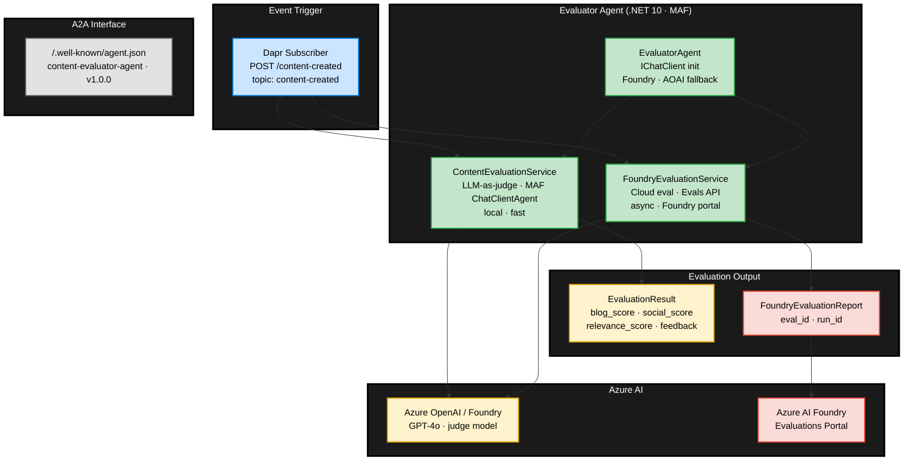
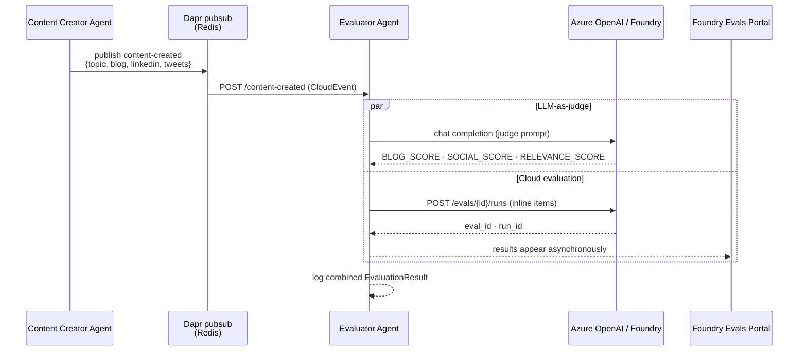

# Evaluator Agent Architecture

.NET agent on [Microsoft Agent Framework](https://github.com/microsoft/agent-framework) that automatically evaluates AI-generated content packages produced by the Content Creator Agent. Triggered via **Dapr pub/sub** (`content-created` topic) and runs two complementary evaluation paths: a fast **LLM-as-judge** (local) via `ContentEvaluationService` and an async **cloud evaluation** via `FoundryEvaluationService` that submits runs to the Azure AI Foundry Evals API.

**Stack:** C# / .NET 10 / ASP.NET Minimal API / Dapr / `Microsoft.Agents.AI` / Azure OpenAI / Azure AI Foundry Evals / OpenTelemetry

## Internal Architecture



## Evaluation Services

### `ContentEvaluationService` — LLM-as-judge

Follows the same MAF executor pattern as the Content Creator: owns a `ChatClientAgent` + `AgentSession`, invokes it with a structured prompt, and parses the plain-text response.

```csharp
_agent = new ChatClientAgent(
    evaluatorAgent.ChatClient,
    name: "evaluator-agent",
    instructions: "You are an expert content quality evaluator...")
  .AsBuilder()
  .UseOpenTelemetry(sourceName: "evaluator-agent", configure: c => c.EnableSensitiveData = true)
  .Build();
```

Prompt format enforces strict structured output:

```
BLOG_SCORE: <1.0–10.0>
SOCIAL_SCORE: <1.0–10.0>
RELEVANCE_SCORE: <1.0–10.0>
BLOG_FEEDBACK: <2-3 sentences>
SOCIAL_FEEDBACK: <2-3 sentences>
RECOMMENDATIONS: <semicolon-separated list>
```

**Retry/Fallback:** up to 3 retries on transient errors; returns neutral fallback scores (5.0) if the LLM is unavailable.

### `FoundryEvaluationService` — Cloud Evaluation

Submits the content package to Azure AI Foundry using the OpenAI Evals API (`EvaluationClient`):

1. **Create evaluation definition** (cached per process start) with `builtin.coherence` + `builtin.fluency` evaluators.
2. **Create evaluation run** with inline items containing the blog post and LinkedIn post.
3. Returns a `FoundryEvaluationReport` — results surface in the Foundry portal.

Supports two authentication modes:
| Mode | Env Vars | Auth |
|------|----------|------|
| Azure AI Foundry project | `AZURE_AI_PROJECT_ENDPOINT` | `DefaultAzureCredential` (Managed Identity / `az login`) |
| Azure OpenAI direct | `AZURE_OPENAI_ENDPOINT` + `AZURE_OPENAI_API_KEY` | `ApiKeyCredential` |

API version pinned to `2025-04-01-preview` — first version exposing `POST /openai/evals/{id}/runs`.

## Event Flow



## Output

```json
{
  "topic": "Azure Container Apps",
  "blog_quality_score": 8.2,
  "social_quality_score": 7.5,
  "relevance_score": 9.0,
  "overall_score": 8.2,
  "blog_feedback": "...",
  "social_feedback": "...",
  "recommendations": ["Add code samples", "Include pricing references"],
  "foundry_report": {
    "evaluation_id": "eval_...",
    "evaluation_run_id": "run_..."
  }
}
```

## A2A Interface

Exposes a standard A2A Agent Card at `/.well-known/agent.json` and `/.well-known/agent-card.json`:

| Field | Value |
|-------|-------|
| Name | `content-evaluator-agent` |
| Skill | `evaluate-content` |
| Transport | JSONRPC |
| Input | `application/json` |
| Output | `application/json` |
| Auth | Bearer (when `A2A_AUTH_ENABLED=true`) |

## Observability

All evaluation spans are emitted under the `evaluator-agent` source and forwarded via OTLP to the Managed OTEL Collector → Application Insights:

```csharp
builder.Services.AddOpenTelemetry()
    .WithTracing(tracing => tracing
        .AddSource("evaluator-agent")
        .AddSource("*Microsoft.Extensions.AI")
        .AddSource("*Microsoft.Agents.AI")
        .AddSource("*Microsoft.Extensions.Agents*"));
```
