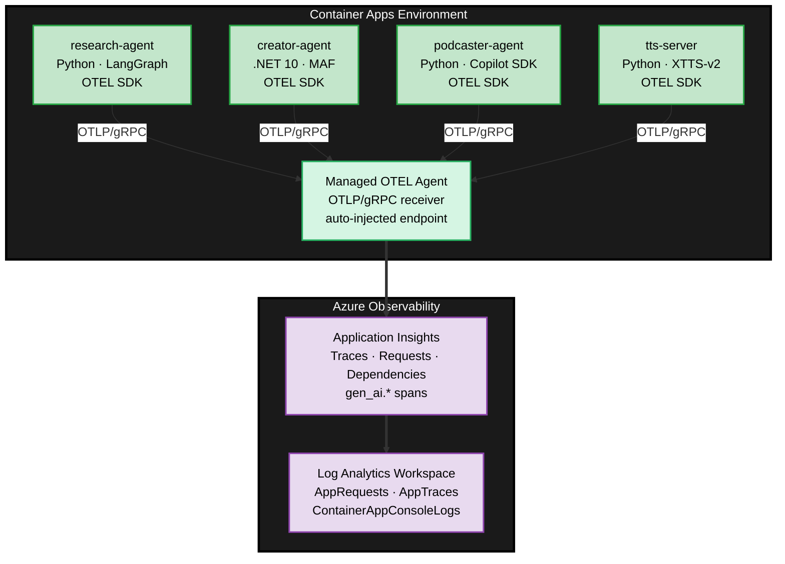

# OpenTelemetry Architecture

End-to-end observability across all four container apps using OTEL SDKs → managed OTEL agent → Application Insights. Each service emits traces, logs, and `gen_ai.*` semantic spans that flow through a shared managed collector without hardcoded endpoints.

## Infrastructure (`infra/main.bicep`)

Three Azure resources back observability:

| Resource | Name pattern | Purpose |
|----------|-------------|---------|
| Log Analytics workspace | `${baseName}-logs` | Raw container logs, backing store for App Insights |
| Application Insights | `${baseName}-appinsights` | Traces, requests, dependencies, `gen_ai.*` spans |
| Container Apps environment | `${baseName}-env` | Hosts managed OTEL agent, routes signals |

The managed environment configures OTEL routing declaratively:

```bicep
appInsightsConfiguration: { connectionString: appInsights.properties.ConnectionString }
openTelemetryConfiguration: {
  tracesConfiguration:  { destinations: ['appInsights'] }
  logsConfiguration:    { destinations: ['appInsights'] }
}
```

Container Apps injects `OTEL_EXPORTER_OTLP_ENDPOINT` and `OTEL_EXPORTER_OTLP_PROTOCOL` automatically — services never hardcode endpoints.

## Service Instrumentation

### Service names (set via `OTEL_SERVICE_NAME` in Bicep)

| Container App | Service name | Stack |
|---------------|-------------|-------|
| agent-research | `research-agent` | Python / FastAPI |
| agent-creator | `creator-agent` | C# / .NET 10 / ASP.NET |
| agent-podcaster | `podcaster-agent` | Python / FastAPI |
| tts-server | `tts-server` | Python / FastAPI |

### Python agents (`research-agent`, `podcaster-agent`, `tts-server`)

Instrumented in each `main.py`:

```python
# Traces
provider = TracerProvider(resource=Resource.create({"service.name": os.getenv("OTEL_SERVICE_NAME", "...")}))
provider.add_span_processor(BatchSpanProcessor(OTLPSpanExporter()))

# Logs + Events (captures gen_ai prompt/response content)
logger_provider = LoggerProvider(resource=resource)
logger_provider.add_log_record_processor(BatchLogRecordProcessor(OTLPLogExporter()))
set_event_logger_provider(EventLoggerProvider(logger_provider))

# Auto-instrumentation
FastAPIInstrumentor.instrument_app(app)    # inbound HTTP
HTTPXClientInstrumentor().instrument()      # outbound HTTP
OpenAIInstrumentor().instrument()           # gen_ai.* spans (research-agent only)
```

The research agent additionally wraps every LangGraph pipeline step in manual spans with `gen_ai.*` attributes (`gen_ai.tool.name`, `gen_ai.tool.type`, `gen_ai.operation.name`).

### .NET agent (`creator-agent`)

Instrumented in `Program.cs`:

```csharp
builder.Services.AddOpenTelemetry()
    .ConfigureResource(r => r.AddService(serviceName: otelServiceName))
    .WithTracing(tracing => tracing
        .AddAspNetCoreInstrumentation()     // inbound HTTP
        .AddHttpClientInstrumentation()     // outbound HTTP
        .AddSource("creator-agent")
        .AddSource("content-agent")
        .AddSource("content-factory-workflow"),
                   "*Microsoft.Extensions.AI", "*Microsoft.Agents.AI")
        .AddOtlpExporter());
```

Each MAF executor emits spans under the shared `creator-agent` source — spans trace through `AIAgent.RunAsync` → `ChatClientAgent` → `IChatClient`.

## Data Flow



1. Service OTEL SDKs emit spans and log events via OTLP/gRPC to the injected endpoint
2. Managed OTEL agent receives and forwards to Application Insights
3. App Insights stores in `requests`, `dependencies`, `traces` tables (backed by Log Analytics)

**Why both SDK and managed agent?** The managed agent only routes — it does not create telemetry. Each service needs its own OTEL SDK to emit spans. The managed agent provides centralized routing, buffering/retry, and backend decoupling (add Datadog or custom OTLP destinations without changing app code).

## Viewing Telemetry

### Application Insights (`${baseName}-appinsights`)

- **Transaction search / Performance** — requests and traces per service
- **Application map** — inter-service call graph
- Filter by `cloud_RoleName`: `research-agent`, `creator-agent`, `podcaster-agent`, `tts-server`

### Key Kusto Queries

```kusto
-- Recent requests by agent
requests | where timestamp > ago(30m)
| project timestamp, cloud_RoleName, name, url | order by timestamp desc | take 50

-- End-to-end trace for most recent request
let recent = toscalar(requests | where timestamp > ago(30m) | top 1 by timestamp desc | project operation_Id);
union requests, dependencies | where operation_Id == recent | order by timestamp asc

-- Container console logs (Log Analytics workspace)
ContainerAppConsoleLogs | where TimeGenerated > ago(1h)
```

## Troubleshooting

| Symptom | Cause | Fix |
|---------|-------|-----|
| No data in App Insights | Hardcoded `OTEL_EXPORTER_OTLP_ENDPOINT=localhost:4317` in Bicep | Remove the env var — let Container Apps inject the correct endpoint, then `azd up` |
| `traces` / `AppTraces` tables empty | No OTEL log exporter configured | Add `LoggerProvider` + `OTLPLogExporter` (already done for research & podcaster agents) |
| Queries return nothing | Wrong resource — App Insights uses `timestamp` / `requests`; Log Analytics uses `TimeGenerated` / `AppRequests` | Check which blade you're in |
