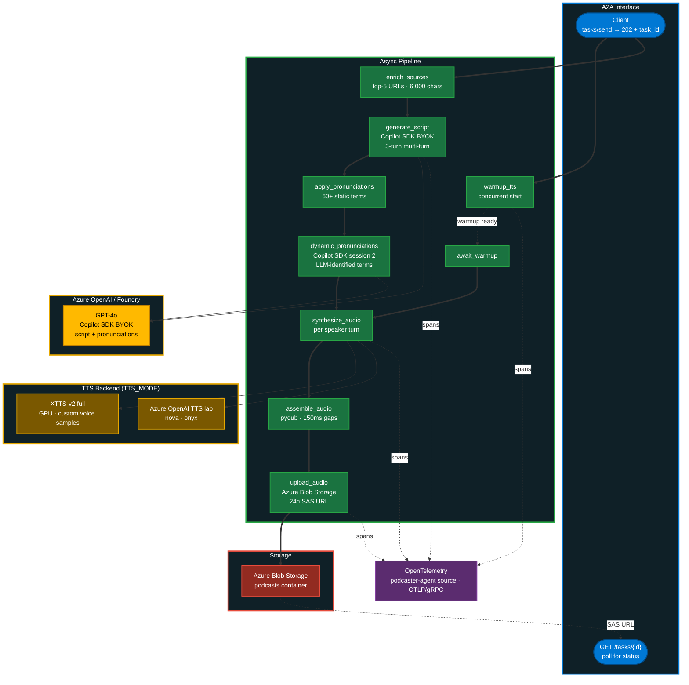

# Podcaster Agent Architecture

Python agent that turns a research brief into a two-host conversational podcast — multi-turn script generation via GitHub Copilot SDK (BYOK), dual TTS backends, MP3 assembly, uploaded to Azure Blob Storage. Exposed as an A2A service.

**Stack:** Python / FastAPI / GitHub Copilot SDK (BYOK → Azure OpenAI) / XTTS-v2 + Azure OpenAI TTS / pydub / Azure Blob Storage / OpenTelemetry

## Pipeline

```
warmup_tts → enrich_sources → generate_script → apply_pronunciations → dynamic_pronunciations → await_warmup → synthesize_audio → assemble_audio → upload_audio
```

Built as an async pipeline in [agent.py](../src/agent-podcaster/agent.py). TTS warmup runs concurrently with source enrichment and script generation to hide cold-start latency.

## Architecture Diagram



## Script Generation (Copilot SDK — Multi-Turn with Tools)

Uses the **GitHub Copilot SDK** in BYOK mode with Azure OpenAI. The `copilot.exe` binary is spawned as a subprocess by `CopilotClient`, communicating via stdio JSON-RPC. BYOK means the binary routes requests to your Azure OpenAI endpoint instead of GitHub Copilot service. In [script_generator.py](../src/agent-podcaster/script_generator.py):

```python
client = CopilotClient({"use_logged_in_user": False})
await client.start()
session = await client.create_session({
    "model": _get_model(),
    "provider": _get_azure_provider(),  # type: "azure", base_url, api_key
    "system_message": {"content": system_prompt},
    "tools": [fetch_url_tool],          # SDK tool for source enrichment
    "on_permission_request": PermissionHandler.approve_all,
})
```

Four Copilot SDK features are used across the pipeline:

| Feature | SDK Capability | Session | Purpose |
|---------|---------------|---------|---------|
| Source enrichment tool | `@define_tool` + `FetchUrlParams(BaseModel)` | Script session | LLM can call `fetch_url` to pull additional source content during generation |
| Multi-turn script generation | `session.send_and_wait()` — turn 1 | Script session | Generate the conversation script |
| Quality critique | `session.send_and_wait()` — turn 2 (same session) | Script session | Self-critique: score 1–10 + feedback JSON |
| Refinement | `session.send_and_wait()` — turn 3 (same session) | Script session | If score < 7, revise based on feedback |
| Dynamic pronunciations | Separate `CopilotClient` + session | Own session | LLM identifies terms needing TTS pronunciation help |

The multi-turn flow within a single session:

```python
# Turn 1: generate script
event = await session.send_and_wait({"prompt": user_prompt}, timeout=120)
conversation = _parse_llm_response(event)

# Turn 2+3: critique and optional refinement (same session)
conversation = await _critique_and_refine(session, conversation, topic, sources)
```

`_critique_and_refine` sends the critique prompt (turn 2), parses `{"score": N, "feedback": "..."}`. If score < 7, sends a revision request (turn 3) and validates the refined output. Falls back to original on any failure.

Returns JSON `{"conversation": [{"speaker","text"}, …]}`. Validated (≥5 turns, both speakers, host opens). Malformed JSON repaired via `json_repair`. Falls back to a 9-turn template script on failure.

## Dynamic Pronunciations (SDK Session #2)

After static dictionary replacement (60+ terms), `generate_dynamic_pronunciations()` creates a **separate** Copilot SDK session with a pronunciation-expert system prompt. The LLM scans the script text and returns `{"term": "phonetic"}` for any additional technical terms the static dictionary missed. Falls back to `{}` on failure — the static dictionary always applies regardless.

## TTS (Dual Backend)

[tts_client.py](../src/agent-podcaster/tts_client.py) supports two modes controlled by `TTS_MODE`:

| Mode | Backend | Voices | Use case |
|------|---------|--------|----------|
| `full` | GPU XTTS-v2 server | Custom WAV samples | Production — natural cloned voices |
| `lab` | Azure OpenAI TTS | nova (host), onyx (guest) | Lab/demo — no GPU required |

Budget timeout (`TTS_TIMEOUT_BUDGET_SECONDS=300`) caps total synthesis time. XTTS retries on 503 with exponential backoff (5s → 10s → 20s). Each turn synthesized sequentially, returns WAV bytes.

## Audio Assembly

[audio_utils.py](../src/agent-podcaster/audio_utils.py) interleaves turn audio with 150ms gaps, inserting 400ms silence every 8 turns as a section break. Converts to MP3 via pydub (falls back to WAV without ffmpeg). Uploads to Azure Blob Storage `podcasts` container with a 24-hour SAS URL.

## Source Enrichment

Before scripting, the agent re-fetches the top 5 URLs from the research brief via [tools/fetch_content.py](../src/agent-podcaster/tools/fetch_content.py) (6000 chars/page, semaphore=5). [tools/pronunciations.py](../src/agent-podcaster/tools/pronunciations.py) replaces 60+ technical terms (kubectl → kube-control, Kubernetes → koo-ber-net-ees) while protecting URLs and inline code via regex.

## A2A Exposure

Served via FastAPI in [main.py](../src/agent-podcaster/main.py). Accepts JSON-RPC `tasks/send` — returns **202 + task ID** (async pattern). Poll `GET /tasks/{id}` for status. Agent card at `/.well-known/agent.json`. Optional auth via Bearer token or `X-API-Key` header (`A2A_AUTH_ENABLED`).

## Observability

Every pipeline step wrapped in an OpenTelemetry span via manual `_tracer.start_as_current_span` with `gen_ai.*` attributes. Auto-instrumented: FastAPI, httpx, OpenAI SDK. Traces and logs export via OTLP/gRPC to the configured collector.

